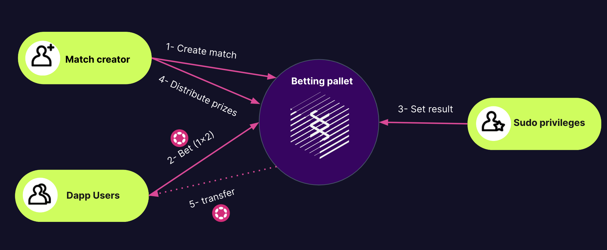

# Betting pallet

## Overview

This pallet implements a basic protocol for decentralized betting.

Every account can create a match where rest of the users can bet. To create a match it is needed to place a deposit that will be returned after distribute the prizes.

The number of bets a user can create now are limited to 1.

Everyone can bet in the match, for a basic result: victory team 1, draw or victory team 2.

When the match is over a user with SUDO priviliges can set the result of the match.

A diagram:


:warning: It is **not a production-ready pallet**, but a sample built for learning purposes. It is discouraged to use this code 'as-is' in a production runtime.

## Configuration

### Types
* `RuntimeEvent` – The overarching event type.
* `Currency` – The currency type.
* `WeightInfo` – Information on runtime weights.

### Constants
* `PalletId` – Pallet ID. Used for account derivation.
* `MaxTeamNameLength` – Maximum length for team names.
* `MatchDeposit` - Deposite needed to create a match
* `MaxBetsPerMatch` – Maximum number of bets per match.

## Extrinsics

<details>
<summary><h3>create_match_to_bet</h3></summary>

Creates a match to bet on. This function must be dispatched by a signed extrinsic.
Emit an event on success: `MatchCreated`.

#### Parameters:
  * `origin` – Origin for the call. Must be signed.
  * `team1` – Name of the first team.
  * `team2` – Name of the second team.
  * `start` – Time when the match starts and a bet can not be placed (in blocks).
  * `lenght` – Duration of the match (in blocks).

#### Errors:
  * `MatchAlreadyExists` – A match for the specified values already exists.
  * `OriginHasAlreadyOpenMatch` – An origin can only have one match open.
  * `TimeMatchOver` – The match is created when the match time is over.
</details>

<details>
<summary><h3>bet</h3></summary>

Create bet for a match.
Emit an event on success: `BetPlaced`.

#### Parameters:
  * `origin` – Origin for the call. Must be signed.
  * `match_id` – Id of the match, in our case the creator of the bet accountId.
  * `amount_to_bet` – Amount placed for the bet.
  * `result` – The result for the bet.

#### Errors:
  * `MatchDoesNotExist` – A match selected for the bet doesn't exist.
  * `OriginHasAlreadyOpenMatch` – If the match has started, betting is not allowed.
  * `TimeMatchOver` – The match is created when the match time is over.
  * `MaxBets` – The match has reach its betting limit.
  * `AlreadyBet` – You already place the same bet in that match.
</details>

<details>
<summary><h3>set_result</h3></summary>

Notify the result of an existing match.
The dispatch origin for this call must be _Root_.
Emit an event on success: `MatchResult`.

#### Parameters:
  * `origin` – Origin for the call. Must be signed.
  * `match_id` – Id of the match, in our case the creator of the bet accountId.
  * `result` – The result of the match.

#### Errors:
  * `MatchDoesNotExist` – A match selected for the bet doesn't exist.
  * `TimeMatchNotOver` –  If the match is not over, set the result is not allowed.
</details>

<details>
<summary><h3>distribute_winnings</h3></summary>

When a match ends someone the owner of the match can distribute the money from the winers and delete the match.
Distribute winnings: take all the prizes on the pot and distribute the prizes evenly. 

Example:

Person A bets 10 UNITS on team1.

Person B bets 10 UNITS on team2.

Person C bets 30 UNITS on team1.

The total Pot is 50 UNITS.

If team1 is the winner, with weighted distribution the person A have to receive the 25% of the pot and the person C the 75%. The maths for this weighted distribution are simple: the amount that one deposit / the total amount of the winners deposit in the case of Person A = 10/40 = 0.25
#### Parameters:
  * `origin` – Origin for the call. Must be signed.

#### Errors:
  * `MatchDoesNotExist` – A match selected for the bet doesn't exist.
  * `MatchNotResult` –  The match still has not a result.
</details>

## RPC 

<details>
<summary><h3>betting_getMatch</h3></summary>

Get a match stored.

#### Parameters:
* `match_id` – ID of the match to retrieve (accountId of the creator).
</details>

## How to add `pallet-betting` to a node

:information_source: The pallet is compatible with Substrate version
[polkadot-v0.9.35](https://github.com/paritytech/substrate/tree/polkadot-v0.9.35).

:information_source: This section is based on
[Substrate node template](https://github.com/substrate-developer-hub/substrate-node-template/tree/main).
Integrating `pallet-betting` with another node might look slightly different.

### Runtime's `Cargo.toml`

Add `pallet-betting`, and the RPC runtime API, to dependencies.
```toml

[dependencies.pallet-betting]
version = "0.0.3"
default-features = false
git = "https://github.com/AlexD10S/substrate-betting.git"
branch = "main"

[dependencies.pallet-betting-rpc-runtime-api]
version = "0.0.1"
default-features = false
git = "https://github.com/AlexD10S/substrate-betting.git"
branch = "main"
```

Update the runtime's `std` feature:
```toml
std = [
    # --snip--
    "pallet-betting/std",
    "pallet-betting-rpc-runtime-api/std",
    # --snip--
]
```

### Node's `Cargo.toml`

Add `pallet-betting-rpc` to dependencies.
```toml

[dependencies.pallet-betting-rpc]
version = "0.0.1"
default-features = false
git = "https://github.com/AlexD10S/substrate-betting.git"
branch = "main"
```

### Runtime's `lib.rs`


Configure the betting pallet.
```rust

parameter_types! {
    pub const MatchDeposit: u64 = 10;
    pub const BettingPalletId: PalletId = PalletId(*b"py/betts");
}

impl pallet_betting::Config for Runtime {
    type RuntimeEvent = RuntimeEvent;
    type PalletId = BettingPalletId;
    type Currency = Balances;
    type MaxTeamNameLength = ConstU32<64>;
    type MaxBetsPerMatch = ConstU32<10>;
	  type MatchDeposit = MatchDeposit;
    type WeightInfo = pallet_betting::weights::SubstrateWeight<Runtime>;
}
```

Add configured pallets to the `construct_runtime` macro call.
```rust
construct_runtime!(
    pub enum Runtime where
        // --snip--
    {
        // --snip---
        Betting: pallet_betting,
        // --snip---
    }
);
```

Add the RPC implementation.
```rust
pub type TeamName = BoundedVec<u8, ConstU32<64>>;
pub type Bet = pallet_betting::Bet<AccountId, pallet_betting::MatchResult, Balance>;
pub type Match = pallet_betting::Match<BlockNumber, TeamName, BoundedVec<Bet, ConstU32<10>>, Balance>;

impl_runtime_apis! {
		impl pallet_betting_rpc_runtime_api::BettingApi<Block, AccountId, Match> for Runtime {
			fn get_match(match_id: AccountId) -> pallet_betting_rpc_runtime_api::RpcResult<Match>
			{
			  Betting::get_match(match_id)
			}
	}
``` 


### Node's `rpc.rs`

Instantiate the RPC extension and merge it into the RPC module.
```rust
pub fn create_full<C, P>(
    deps: FullDeps<C, P>,
) -> Result<RpcModule<()>, Box<dyn std::error::Error + Send + Sync>>
where
    // --snip--
    C::Api: pallet_betting_rpc::BettingRuntimeApi<Block, Balance>,
{
    use pallet_betting_rpc::{Betting, BettingApiServer};
    // --snip--
    module.merge(Betting::new(client).into_rpc())?;
    Ok(module)
}
``` 
